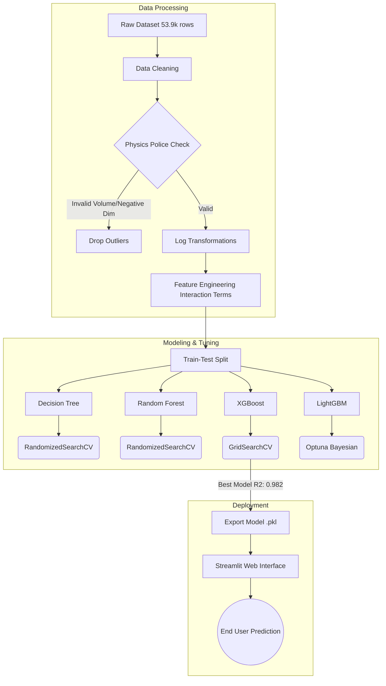

# 💎DiaQueen - AI-Powered Diamond Price Prediction

>  An end-to-end machine learning application that democratizes diamond valuation, combining fine-tuned decision tree models (LightGBM, XGBoost, Random Forest, Decision Tree),  and a real-time, parametric 3D diamond mesh generator that visually adapts to user inputs for Table, Depth, and Carat.

[](https://diaqueen.streamlit.app/)

## Table of Contents

- [Overview](#overview)
- [Features](#features)
- [Tech Stack](#tech-stack)
- [Architecture](#architecture)
- [Data Engineering Highlights](#data-engineering-highlights)
- [Model Performance](#model-performance)
- [Repo Structure](#repo-structure)
- [Quick Start](#quick-start)
- [Team & Contributors](#team-contribution)

---

## Overview

In a high-value, non-linear market, the 4Cs (Carat, Cut, Color, Clarity) interact in complex ways to determine a diamond's worth. Traditional pricing relies heavily on subjective human judgment.

DiaQueen is a data-driven solution designed to forecast diamond prices with quantitative accuracy. Built using the Diamond Prices 2022 dataset (comprising 53,943 round-cut diamonds), this project explores four distinct machine learning architectures to provide real-time, highly accurate valuation insights for consumers and industry stakeholders (like De Beers).

---

## Features

### 🔬 Machine Learning Pipeline

| Feature | Description |
|---|---|
| **Data Cleansing (The "Physics Police")** | Algorithmic detection and removal of physically impossible diamonds (e.g., calculating theoretical volume limits based on carbon density). |
| **Advanced Feature Engineering** | Creation of interaction terms (Carat × Cut, Carat × Clarity) to solve the "Scarcity Imbalance" of large, flawless diamonds. |
| **Statistical Target Transformation** | Logarithmic transformations applied to skewed variables (Price, Carat, Volume) to stabilize variance (heteroscedasticity) and improve tree-model binning. |
| **Hyperparameter Optimization** | Exhaustive tuning utilizing GridSearchCV, RandomizedSearchCV, and Optuna (Bayesian Optimization) to balance bias and variance. |

### 💻 Streamlit Web Application

| Feature | Description |
|---|---|
| **Interactive Prediction Engine** | Users can input the 4Cs and dimensional data to receive instant price estimations in USD. |
| **Multi-Model Selection** | Toggle between LightGBM (fast, high precision) and XGBoost (highest overall accuracy) in real-time. |
| **Extrapolation Warnings** | Built-in alerts that notify users if inputted parameters exceed the physical limits of the training data. |

---

## Tech Stack

### Data Science & Machine Learning

| Category | Technology |
|---|---|
| **Languages** | Python |
| **Data Manipulation** | Pandas, NumPy |
| **Data Visualization** | Matplotlib, Seaborn |
| **Machine Learning** | Scikit-Learn (Decision Tree, Random Forest) |
| **Gradient Boosting** | XGBoost, LightGBM |
| **Optimization** | Optuna (TPE / Bayesian), GridSearchCV |

### Web Application & Deployment

| Category | Technology |
|---|---|
| **Frontend/Framework** | Streamlit |
| **Hosting** | Streamlit Community Cloud |


---

## Architecture



---

## Data Engineering Highlights

To achieve production-grade accuracy, several advanced data engineering techniques were applied to the dataset:

1. **The "Physics Police" (Volume vs. Carat Validation):** — Diamond density is a constan. We calculated the theoretical volume for every diamond. Any diamond occupying less than the constant is physically impossible (denser than pure carbon). These data entry anomalies were programmatically dropped.
2. **Handling The Size Bias (Simpson's Paradox):** — Exploratory Data Analysis revealed that lower clarity/color grades had higher average prices. We identified this as a size bias—nature rarely produces large, flawless diamonds, meaning lower grades are dominated by massive stones. We utilized interaction features to disentangle the premium for quality from the premium for size.
3. **Logarithmic Scaling:** — The raw price distribution was heavily right-skewed (a classic Pareto distribution). We applied $Log(Price)$ and $Log(Carat)$ transformations to resolve heteroscedasticity, ensuring our models minimized percentage errors (MAPE) rather than chasing absolute dollar errors on extreme luxury outliers.

---

## Model Performance

Four models were rigorously evaluated based on Mean Absolute Error (MAE), Root Mean Squared Error (RMSE), Mean Absolute Percentage Error (MAPE), and R-Squared.

**XGBoost Regressor** emerged as the superior model, demonstrating the greatest resilience against extreme mispredictions.

| Metric | Decision Tree | Random Forest | XGBoost (Best) | LightGBM | 
|---|---|---|---|---|
| R-Squared | 0.9784 | 0.9804 | **0.9824** | 0.9802 |
| MAPE (%) | 8.39% | 7.87% | **7.35%** | 7.87% |
| MAE (USD) | $306.45 | $285.89 | **$272.44** | $282.31 |
| RMSE (USD) | $587.09 | $559.59 | **$529.01** | $562.21 |


---

## Repo Structure

```
diaqueen/
├── app.py                                      # Main Streamlit application script
├── requirements.txt                            # Python dependencies
├── models/
│   ├── xgboost_diamond_model.json              # Saved XGBoost weights
│   └── lightgbm_diamond_model.pkl              # Saved LightGBM weights
│   └── decision_tree_diamond_model.pkl         # Saved Decision Tree weights
├── utils/
│   └── Diamonds_Prices2022.csv # Original dataset
└── README.md                   # Project documentation

```


> Three model provided, which are LightGBM, XGBoost and Decision Tree in the application
